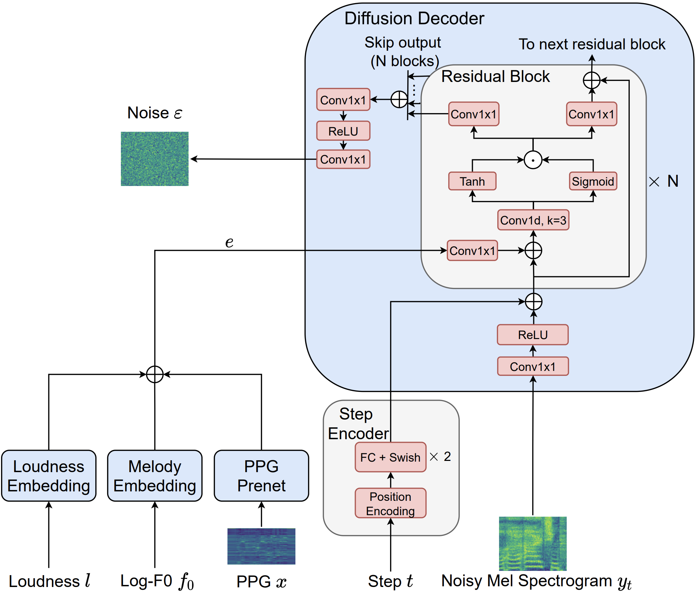

# Diffusion-Based Any-to-Any Voice Conversion 

https://github.com/huawei-noah/Speech-Backbones

Implementation of the paper "Diffusion-Based Voice Conversion with Fast Maximum Likelihood Sampling Scheme" (ICLR 2022, Oral). [Link](https://arxiv.org/abs/2109.13821).

[Demo page](https://diffvc-fast-ml-solver.github.io/).

# TODO

use for svc

DiffSVC: A Diffusion Probabilistic Model for Singing Voice Conversion

# Voice conversion with the pre-trained models

Please check *inference.ipynb* for the detailed instructions.

The pre-trained universal HiFi-GAN vocoder we use is available at https://drive.google.com/file/d/10khlrM645pTbQ4rc2aNEYPba8RFDBkW-/view?usp=sharing. It is taken from the official HiFi-GAN repository. Please put it to *checkpts/vocoder/*

You have to download voice conversion model trained on LibriTTS from here: https://drive.google.com/file/d/18Xbme0CTVo58p2vOHoTQm8PBGW7oEjAy/view?usp=sharing

Additionally, we provide voice conversion model trained on VCTK: https://drive.google.com/file/d/12s9RPmwp9suleMkBCVetD8pub7wsDAy4/view?usp=sharing

Please put voice conversion models to *checkpts/vc/*

# Training your own model

0. To train model on your data, first create a data directory with three folders: "wavs", "mels" and "embeds". Put raw audio files sampled at 22.05kHz to "wavs" directory. The functions for calculating mel-spectrograms and extracting 256-dimensional speaker embeddings with the pre-trained speaker verification network located at *checkpts/spk_encoder/* can be found at *inference.ipynb* notebook (*get_mel* and *get_embed* correspondingly). Please put these data to "mels" and "embeds" folders respectively. Note that all the folders in your data directory should have subfolders corresponding to particular speakers and containing data only for corresponding speakers.

1. If you want to train the encoder, create "logs_enc" directory and run *train_enc.py*. Before that, you have to prepare another folder "mels_mode" with mel-spectrograms of the "average voice" (i.e. target mels for the encoder) in the data directory. To obtain them, you have to run Montreal Forced Aligner on the input mels, get *.TextGrid* files and put them to "textgrids" folder in the data directory. Once you have "mels" and "textgrids" folders, run *get_avg_mels.ipynb*.

2. Alternatively, you may load the encoder trained on LibriTTS from https://drive.google.com/file/d/1JdoC5hh7k6Nz_oTcumH0nXNEib-GDbSq/view?usp=sharing and put it to "logs_enc" directory.

3. Once you have the encoder *enc.pt* in "logs_enc" directory, create "logs_dec" directory and run *train_dec.py* to train the diffusion-based decoder.

4. Please check *params.py* for the most important hyperparameters.
